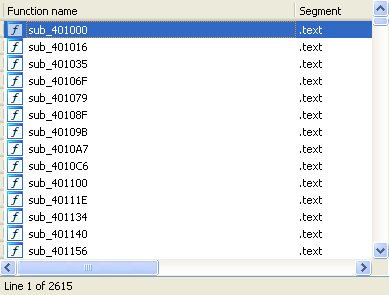
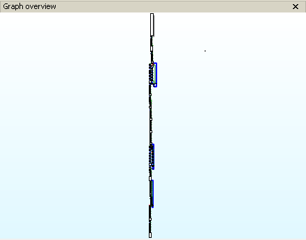

# Sharif CTF 8 - Keygen

## Information
**Category:** | **Points:** | **Writeup Author**
--- | --- | ---
Reverse | 200 | AlexZ


> Find the password if you can!

[Binary](./findpass)

## Solution
We have exe file which asks us for a password.
> Enter password please:

If we type something and press enter, there is no output, and any further key closes the app.
After opening binary in IDA, we can see 2615 functions and IDA cannot determine any useful names.



### main
Let's find `main` first. For this, I started debugger and stepped-over `start` function. After `call sub_406240` the program continues running and didn't return into debugger. Function `sub_406240` has a huge disassembly graph and lots of `xmm` operations which are used similarly as in [Crack me!](../crackme) task for obfuscation. So it's most likely our `main`.



### Messages
There are no interesting plain strings in binary, but at the top of `main` function we can see initialization of some local array (or arrays):
```asm
.text:0040628C                 mov     [ebp+var_30], 71h
.text:00406290                 mov     [ebp+var_2F], 5Ch
...
.text:004063C2                 mov     [ebp+var_13], 30h
```
Unfortunately, nothing readable. But after analyzing several calls after this (`.text:004065A4 .. .text:00406645`), we can found interesting `sub_403320` (`xor` later) which simply does block xor with passed key. So, this function decrypts our password prompt from one part of this array using key `'423060'`. Other surrounding functions does initialization of C++ - strings and IO using `cin`/`cout` (this assumption based on similarity with same functions in _Crack me!_ task and some intuition, it's really difficult to work with library functions without any names).
In pseudocode it looks like this:
```c++
cout << xor(&array[...], "423060") << ":\n";
cin >> input;
```

There is one another reference to our array: in the bottom of `main` we find a very similar block which is executed only if some local variable (`result` later) equals 1.
```asm
.text:0040837C                 cmp     [ebp+result], 1
.text:00408383                 jnz     short loc_4083ED
...
.text:004083AC                 call    xor
...
.text:004083D0                 push    eax
.text:004083D1                 push    offset cout
.text:004083D6                 call    shift_left   ; <<
```
Very interesting! Let's go to the debugger and patch this variable to 1. Then we can see
> Well done,Flag is md5 of input string.

on the console. So, our task is to find the input which leads `result` to be 1.

### check_flags
There are only two xrefs to `result`, both from `main`.


First unconditionally sets it to 1. Second happens later in for loop: if the k-th item of global `int[5]` array at .data:00456414 (`check_flags` later) equals 0, then `result` becomes 0:
```asm
.text:00408183                 cmp     check_flags[ecx*4], 0
.text:0040818B                 jnz     short loc_408199
.text:0040818D                 mov     [ebp+result], 0
```
Ok, now we need to have all `check_flags[i]` to be 1. Let's see xrefs to `check_flags`:


There are references from `main` function and from 5 other functions (`check0` ... `check4`) which are _almost_ identical. Every function:
- takes one argument (as we can see in debugger, it is one part of space-splitted user input)
- inits some local array
- then calls `xor` with argument and one part of the array as a key
- checks equality with another part of the array
- `checki()` sets `check_flags[i] = 1` only if `xor` result equals to expected.

So we can simply go to the debugger, enter some string, watch at every `checki()` which key is used and which result is expected, then xor them...
After concatenation of all required arguments (for `check0` ... `check4`) with spaces, we have `Flag: {HiBC NBG8L >65D OMSDF}`. But this input is accepted under debugger only.

### Anti-debugging
At this point I have spent a couple of hours, trying to understand which checks are failed without a debugger. After several patching (replacing `result` check with `check_flags[i]` check) I determined that problem is `check3` and `check4` functions. 
After looking more carefully at array initialization in `check3` we find `some_flag` global variable which adds to one of elements of the array.
```asm
.text:00405FD0                 mov     [ebp+var_16], 6Fh
.text:00405FD4                 mov     [ebp+var_15], 1Eh
.text:00405FD8                 mov     [ebp+var_14], 0
.text:00405FDC                 mov     eax, 1
.text:00405FE1                 imul    ecx, eax, 0
.text:00405FE4                 movsx   edx, [ebp+ecx+var_18]
.text:00405FE9                 add     edx, some_flag
.text:00405FEF                 mov     eax, 1
.text:00405FF4                 imul    ecx, eax, 0
.text:00405FF7                 mov     [ebp+ecx+var_18], dl
.text:00405FFB                 mov     [ebp+var_19], 5Ah
```
There are only two other references to `some_flag`:
- in `main`, `some_flag = 1` if there are more than 5 parts of flag (i.e. `len(flag.split(' ')) > 5`.
- in `sub_4050F0` where it is set to result of `sub_4043C0`. After looking at the code of `sub_4043C0` we find that it returns 1 or 0 based on some values in system structures. For example, it checks that `*(_BYTE *)(__readfsdword(0x30) + 2)` (which is `BeingDebugged` field in [PEB struct](https://msdn.microsoft.com/ru-ru/library/windows/desktop/aa813706(v=vs.85).aspx)) isn't zero. In this case, `result` will be 1. I.e. `result` is 1 if a debugger is present.

`check4` also uses a similar global variable, `some_flag2`. This flag is set by `sub_404DA0` which simply tries to call `OutputDebugStringW` and then check success using `GetLastError`:
```asm
.text:00404F30                 push    offset OutputString ; "Error"
.text:00404F35                 call    ds:OutputDebugStringW
...
.text:004050C5                 call    ds:GetLastError
.text:004050CB                 test    eax, eax
.text:004050CD                 jnz     short loc_4050DB
.text:004050CF                 mov     some_flag2, 1
.text:004050D9                 jmp     short loc_4050E5
.text:004050DB ; -----------------------------------------------------------
.text:004050DB
.text:004050DB loc_4050DB:
.text:004050DB                 mov     some_flag2, 0
```
Okay, let's patch these functions, so that they will always return 0, and do xor in `check3` and `check4` again.
We have input `Flag: {HiBC NBG8L 965D LMSDF}` and it's accepted without a debugger.

### Flag
SharifCTF{9a55042d8cba49ef460ac8872eff0902}
